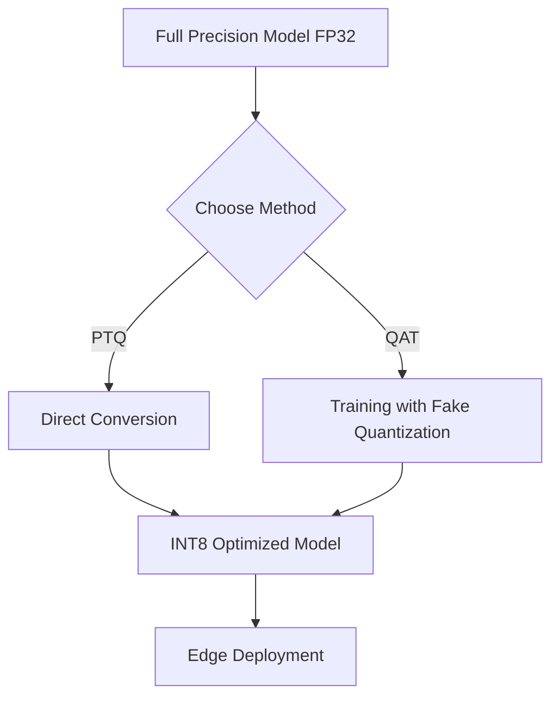

# 📉 Large Model Quantization: A Deep Dive

Available at: [github.com/adiel2012/model-size-reduction](https://github.com/adiel2012/model-size-reduction)

Welcome to the world of **Model Quantization**, where we trade a tiny bit of precision for massive gains in efficiency, speed, and deployability.

## 🚀 What is Model Quantization?

At its core, **model quantization** is the process of mapping high-precision floating-point numbers (usually 32-bit floats, `FP32`) to lower-precision representations (like 8-bit integers, `INT8`). 

Imagine trying to store a high-resolution photograph in a format that uses only 256 colors. While you lose some nuance, the file size shrinks dramatically, and the image remains recognizable. Quantization does exactly this for the billions of "weights" inside a Deep Learning model.

### 🧩 Why do we do it?

1.  **Reduced Model Size**: An `INT8` model is 4x smaller than an `FP32` model. This allows large models like Llama-3 or Stable Diffusion to fit on your smartphone or edge devices.
2.  **Increased Inference Speed**: Specialized hardware (NPUs, TPUs, and modern CPUs) can process integer arithmetic much faster than floating-point math.
3.  **Lower Power Consumption**: Moving 8 bits of data across a chip consumes much less energy than moving 32 bits, making it crucial for battery-powered devices.

---

## 🛠️ The Mechanics: How it Works

Quantization isn't just "rounding numbers." We use a mathematical mapping to preserve as much information as possible.

### The Linear Mapping Formula
Most quantization schemes follow this linear relationship:

$$r = S \cdot (q - Z)$$

Where:
- $r$: The original floating-point value.
- $S$: **Scale factor** (a floating-point number).
- $q$: The quantized integer value.
- $Z$: **Zero-point** (the integer value that represents $0$ in the real domain).

### Dynamic Range
The challenge is finding the optimal `Scale` and `Zero-point` that capture the "range" of your model's weights and activations without clipping important outliers.

---

## 🏗️ Two Main Flavors of Quantization

Depending on *when* you quantize, you can choose between two primary methods:

### 1. Post-Training Quantization (PTQ)
The "easy" button. You take a pre-trained `FP32` model and convert it.
- **Pros**: Fast, no retraining required.
- **Cons**: Can lead to significant accuracy drops, especially in sensitive models.

### 2. Quantization-Aware Training (QAT)
The "gold standard." You simulate quantization *during* the training process. The model "learns" to be accurate despite the lower precision.
- **Pros**: Minimal accuracy loss.
- **Cons**: Requires expensive retraining.



---

## 📈 Comparison Table

| Feature | FP32 (Base) | INT8 (Quantized) |
| :--- | :--- | :--- |
| **Memory Usage** | 100% | ~25% |
| **Latency** | Standard | High (Faster) |
| **Accuracy** | Baseline | Minimal Impact |
| **Energy** | High | Low |

---

## 📅 The Evolution of Quantization (2022-2026)

Model quantization has advanced rapidly, moving from simple rounding to complex mathematical optimizations.

| Year | Algorithm | Key Innovation | Demo (Colab) |
| :--- | :--- | :--- | :--- |
| **2022** | **LLM.int8()** | Vector-wise quantization with outlier handling. | [](https://colab.research.google.com/github/adiel2012/model-size-reduction/blob/main/chronology/llm_int8_demo.ipynb) |
| **2023** | **GPTQ** | Optimal Brain Quantization; Hessian-based 4-bit standard. | [](https://colab.research.google.com/github/adiel2012/model-size-reduction/blob/main/chronology/gptq_demo.ipynb) |
| **2023** | **AWQ** | Activation-aware; protects "salient" weights. | [](https://colab.research.google.com/github/adiel2012/model-size-reduction/blob/main/chronology/awq_demo.ipynb) |
| **2023** | **NF4 (QLoRA)** | Information-theoretically optimal for normal weights. | [](https://colab.research.google.com/github/adiel2012/model-size-reduction/blob/main/chronology/nf4_demo.ipynb) |
| **2024** | **HQQ** | No calibration data needed; extremely fast solver. | [](https://colab.research.google.com/github/adiel2012/model-size-reduction/blob/main/chronology/hqq_demo.ipynb) |
| **2025** | **BitNet 1.58b** | Ternary weights ({-1, 0, 1}); CPU-friendly additions. | [](https://colab.research.google.com/github/adiel2012/model-size-reduction/blob/main/chronology/bitnet_demo.ipynb) |
| **2026** | **T-Poti / Ultra-Low** | Massive shift toward 1-bit and 2-bit standard. | [](https://colab.research.google.com/github/adiel2012/model-size-reduction/blob/main/chronology/tpoti_demo.ipynb) |

---

## 🔬 Algorithm Comparison: Theory at a Glance

The table below compares all covered algorithms across the dimensions that matter most when choosing a quantization strategy.

| Algorithm | Year | Bits | Method | Calibration data | Scale granularity | Activation-aware | Approx. memory vs FP16 | Accuracy retention (0–100) | Key limitation |
| :--- | :---: | :---: | :---: | :---: | :--- | :---: | :---: | :---: | :--- |
| **LLM.int8()** | 2022 | 8 | PTQ | None | Vector-wise (per row/col) | ✅ (outlier split) | ~2× | 99 | Slower than FP16 on some GPUs |
| **GPTQ** | 2023 | 4 | PTQ | Small (~128 samples) | Per-column (Hessian) | ✅ (via Hessian $H$) | ~4× | 99 | Slow to quantize; needs calibration |
| **AWQ** | 2023 | 4 | PTQ | Small | Per-channel scale | ✅ (salient channels) | ~4× | 99 | Heuristic $\alpha$ grid search |
| **NF4 (QLoRA)** | 2023 | 4 | PTQ | None | Per-block absmax | ❌ | ~4× | 98 | Assumes Gaussian weight distribution |
| **HQQ** | 2024 | 4 | PTQ | None | Per-block (ALS) | ❌ | ~4× | 97 | No activation awareness |
| **BitNet 1.58b** | 2025 | ~1.58 | QAT | N/A (train from scratch) | Per-tensor (absmean) | ✅ (INT8 activations) | ~10× | 95 | Requires training from scratch |
| **T-Poti** | 2026 | 1–2 | PTQ | None | Per-tensor | ❌ | ~16–32× | 70 | Extreme accuracy loss without QAT |

### Decision Guide

```
Need to quantize an existing model?
 └─ 8-bit target → LLM.int8()
 └─ 4-bit target, have calibration data?
      ├─ Yes, want best accuracy → GPTQ
      ├─ Yes, want hardware-friendly → AWQ
      └─ No calibration available?
           ├─ Weights are Gaussian → NF4 (QLoRA)
           └─ Want fastest quantization → HQQ
Building a model from scratch for edge?
 └─ Power matters most → BitNet 1.58b (QAT)
 └─ Absolute minimum size → T-Poti (1–2 bit)
```

### Key Theoretical Trade-offs

| Trade-off | Winner |
| :--- | :--- |
| **Highest accuracy at 4-bit** | GPTQ ≈ AWQ > NF4 > HQQ |
| **Fastest quantization** | HQQ > NF4 > AWQ > GPTQ |
| **No calibration data needed** | NF4, HQQ, T-Poti |
| **Most memory efficient** | T-Poti (1-bit) > BitNet (1.58-bit) > 4-bit methods |
| **Best for edge / CPU** | BitNet 1.58b (addition-only arithmetic) |
| **Best activation handling** | LLM.int8() (explicit outlier separation) |

---

## 🎓 Knowledge Distillation

While quantization shrinks the weights, **Knowledge Distillation (KD)** transfers intelligence from a massive model (the **Teacher**) to a compact one (the **Student**).

- **Vanilla Distillation**: The student matches the teacher's final output probabilities.
- **Feature Distillation**: The student matches the teacher's internal hidden layers.
- **Logic Distillation**: The student learns the "reasoning" steps of models like DeepSeek-R1.

### Hands-on Distillation
- **[Knowledge Distillation Demo (Notebook)](file:///d:/Adiel/model-quantization/distillation_demo.ipynb)**: Training a mini-GPT-2 student from a full teacher.

[](https://colab.research.google.com/github/adiel2012/model-size-reduction/blob/main/distillation_demo.ipynb)

---

## ✂️ Model Pruning

Quantization reduces bit-depth, Distillation transfers intelligence, and **Pruning** removes the parameters themselves. By zeroing out the least important weights, we create "sparse" models.

- **Unstructured Pruning**: Removes individual connections.
- **Structured Pruning**: Removes entire blocks (neurons/layers).
- **Magnitude-based**: The most common method; removes weights closest to zero.

### Hands-on Pruning
- **[Model Pruning Demo (Notebook)](file:///d:/Adiel/model-quantization/pruning_demo.ipynb)**: Pruning GPT-2 by 30% and verifying performance.

[](https://colab.research.google.com/github/adiel2012/model-size-reduction/blob/main/pruning_demo.ipynb)

---

## 🏁 Getting Started
To see quantization in action, check out our first hands-on milestone:
- **[LLM.int8() Quantization Demo (Notebook)](file:///d:/Adiel/model-quantization/chronology/llm_int8_demo.ipynb)**: A from-scratch implementation of outlier-aware 8-bit quantization.

[](https://colab.research.google.com/github/adiel2012/model-size-reduction/blob/main/chronology/llm_int8_demo.ipynb)

Or use popular industry libraries:
- **PyTorch/TensorFlow**: Native quantization suites.
- **AutoGPTQ / AutoAWQ**: Industry standards for LLMs.
- **BitsAndBytes**: Famous for 4-bit and 8-bit quantization in HuggingFace.

---
> [!TIP]
> Always start with **PTQ** first. If the accuracy drop is unacceptable, only then consider the complexity of **QAT**.
